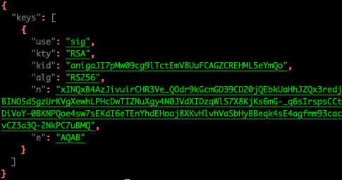
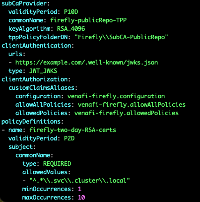

# Firefly, TPP and public Repos

# Pre-Requisites

- Kubernetes Cluster
- Access to Certificate Manager Cloud / Certificate Manager Self-Hosted
- Tools: `venctl`, `vcert`
- all files located in `~/demo/firefly-tpp`
- local envvars set for
    - NAME=clustername
    - VCERT_URL=https://tpp.domain.test:443/
- network connectivity between microk8s node and TPP API (port 443)
- network connectivity between TPP and OIDC endpoint of K8 node (port 8443)

---

## Configurations in Certificate Manager Self-Hosted

Official documentation at [https://docs.venafi.cloud/firefly/c-ff-tpp-overview/](https://docs.venafi.cloud/firefly/c-ff-tpp-overview/).

### Create the Following in TPP

if missing in TPP, create these API integration and assign the relevant API users to them

In TPP -> API Integration -> import:

```
{
  "id": "venctl",
  "name": "Venafi CLI",
  "vendor": "CyberArk Software Ltd.",
  "description": "CLI utility for managing Firefly configurations",
  "scope": "configuration;security:delete,manage;certificate:manage"
}

{
  "id": "firefly",
  "name": "Firefly",
  "vendor": "CyberArk Software Ltd.",
  "description": "Decentralized workload identity issuance governed by a control plane",
  "scope": "certificate:manage;security:manage"
}

```

### venctl installer:

https://docs.cyberark.com/mis-saas/vaas/venctl/t-venctl-install/

## A/ Deploy CF template for microk8s instance in AWS

```jsx
cd ~/demo/firefly-tpp
export NAME="m16c"
aws cloudformation deploy \
--template-file microk8s-base.yaml \
--stack-name $NAME \
--region ap-southeast-2 \
--parameter-overrides HostedZoneName=mimlab.io. \
ClusterName=$NAME \
FQDN=$NAME.mimlab.io
```

## B/ Create the JWT Mapping in TPP

update the JSON payload to reflect the new cluster name (mapping to user BOB in AD)

using the simpler username (bob) as per below instead of the ‘resolved name’

 

```yaml
"GranteePrefixedUniversal": "AD+VenafiLab-AD:1932309a28daf34db5c942630c3a2cc4"
```

```jsx
{
  "Name": "NAME",
  "IssuerUri": "https://NAME.mimlab.io:8443",
  "PurposeField": "aud",
  "PurposeMatch":"tpp",
  "IdField": "sub",
  "IdMatch": "system:serviceaccount:cyberark:venafi-connection",
  "GranteePrefixedUniversal": "bob"
}
```

Send to TPP to check that a valid OAUTH token is returned:

```jsx
curl -sX POST $VCERT_URL/vedsdk/oauth/createjwtmapping \
     -H "Authorization: Bearer "$BEARER \
     -H "Content-Type:application/json" \
     -d @../microk8s/create-tpp-jwt-mapping.json | jq
```

## C/ Retrieve K8s Config

SSH to new K8s node and pull config

```bash
ssh -i ~/.ssh/jyp-aws-anz.pem ubuntu@$NAME.mimlab.io \
'microk8s kubectl config view --raw' > /tmp/$NAME.kubeconfig

chmod 600 /tmp/$NAME.kubeconfig
export KUBECONFIG=/tmp/$NAME.kubeconfig

kubectl get pods 
```

Also, now is a good time to check the OIDC endpoint of our single node microk8s environment. This endpoint will be used by TPP to check that the JWT presented by the cluster is valid.

```yaml
curl -sk https://$NAME.mimlab.io:8443/openid/v1/jwks | jq
```



## D/ Create k8s resources

Sample CA-roots.pem file

```bash
-----BEGIN CERTIFICATE-----
MIIDaTCCAlGgAwIBAgIQFnSXFxdbiqdK59how61UdzANBgkqhkiG9w0BAQsFADBH
...
m6RF9Bb8tf7QBhIXmg==
-----END CERTIFICATE-----
-----BEGIN CERTIFICATE-----
MIIEyDCCA7CgAwIBAgIQDPW9BitWAvR6uFAsI8zwZjANBgkqhkiG9w0BAQsFADBh
...
JCqVJUzKoZHm1Lesh3Sz8W2jmdv51b2EQJ8HmA==
-----END CERTIFICATE-----

```

all config files are in the ```demo/microk8s/firefly``` directory

```bash

#Namespaces
kubectl apply -f namespaces/cyberark.yaml
kubectl apply -f namespaces/sandbox.yaml

#TPP Cert trustbundle
kubectl create secret generic ca-bundle-cert \
  --namespace cyberark \
  "--from-file=ca-bundle-cert=CA-roots.pem"

#RBAC
kubectl apply -f private-ca-issuer/public-repos/venafi-connection-jwt-rbac.yaml
```

## E / Helm chart for Venafi Connection

```bash
helm upgrade venafi-connection oci://registry.venafi.cloud/charts/venafi-connection \
  --install \
  --wait \
  --namespace cyberark \
  --version 0.5.2
```

Followed by the creation of the connection

example YAML for VenafiConnection resource

```yaml
apiVersion: jetstack.io/v1alpha1
kind: VenafiConnection
metadata:
  name: vtpp-connection-jwt
  namespace: cyberark
spec:
  tpp:
    url: https://jyptest-tpp.se.venafi.com
    accessToken:
    - serviceAccountToken:
        audiences: ["tpp"]
        name: venafi-connection
    - tppOAuth:
        authInputType: JWT
        clientId: firefly
        url: https://jyptest-tpp.se.venafi.com
```

```bash
kubectl apply -f private-ca-issuer/public-repos/vtpp-cluster-connection-jwt.yaml
```

Test that a JWT can be used to get a OAUth Grant from TPP:

```bash
export jwt=`k create token -n cyberark venafi-connection --audience tpp` ; \
curl -s $VCERT_URL/vedauth/Authorize/Jwt \
-d '{"client_id":"firefly","scope":"certificate","jwt":"'$jwt'"}' \
-H 'Content-Type: application/json' | jq
```


## F/ Deploy workload identity issuer

Before deploying the Helm Chart, we need to ensure that the Firefly Policy file is available on TPP and in the correct location. in this example, the ConfigurationDN for Firefly configuration is stored in Firefly\tpp-public-config

This can be checked using the ```venctl pull``` command

```bash
venctl configuration firefly pull \
--api-url $VCERT_URL \
--name "Firefly\tpp-public-config" \
--username $USER \
--password $PASSWD
```

This command will return the FF policy stored in TPP



Values file used by helm chart:

```yaml
acceptTerms: true
deployment:
  extraVolumes:
  - name: ca-bundle-cert
    secret:
      secretName: ca-bundle-cert
  extraVolumeMounts:
  - mountPath: /etc/ssl/certs/
    name: ca-bundle-cert

  config:
    bootstrap:
      tpp:
        enabled: true
        configurationDN: Firefly\tpp-public-config
        connection:
          name: "vtpp-connection-jwt"
        csr:
          instanceNaming: "SUBCA-CERTIFICATE"
    controller:
      certManager:
        checkApproval: false
        
  replicaCount: 1
```

Deployment

```bash
helm upgrade firefly oci://registry.venafi.cloud/public/venafi-images/helm/firefly \
    --install \
    --wait \
    --namespace cyberark \
    --values ./values-files/FF-short.yaml \
    --version v1.10.2
```


You can also check the state of the ‘venaficonnection’ created ealier. note that if sucessful, the status should show ‘Token Generated’

```yaml
kubectl describe -n cyberark venaficonnections.jetstack.io
```


## G/ Check certificate issuance

Sample cert resource to be created in sandbox namespace for a certificate issued by FireFly:

```yaml
  apiVersion: cert-manager.io/v1
  kind: Certificate
  metadata:
    name: cert-20mins-1.svc.cluster.local
    namespace: sandbox
    annotations:
      firefly.venafi.com/policy-name: firefly-two-day-RSA-certs
  spec:
    isCA: false
    commonName: cert-20mins-1.svc.cluster.local
    dnsNames:
    - cert-20mins-1.svc.cluster.local
    privateKey:
      algorithm: RSA
      rotationPolicy: Always
    renewBefore: 2860m # renew every 20 mins (2days ~ 2880-20m)
    secretName: cert-20mins-1.svc.cluster.local
    issuerRef:
      name: firefly
      group: firefly.venafi.com
```

```bash
 kubectl apply -f sample-firefly-certificate-20m.yaml
```


